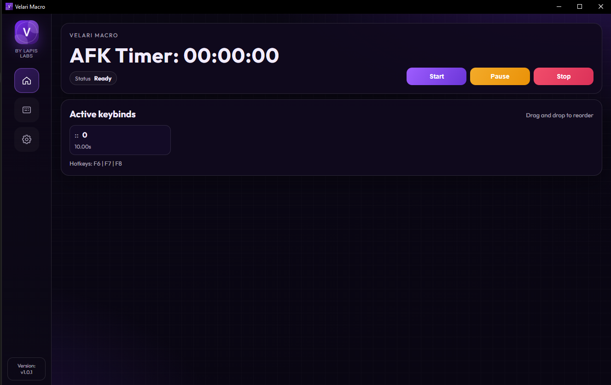
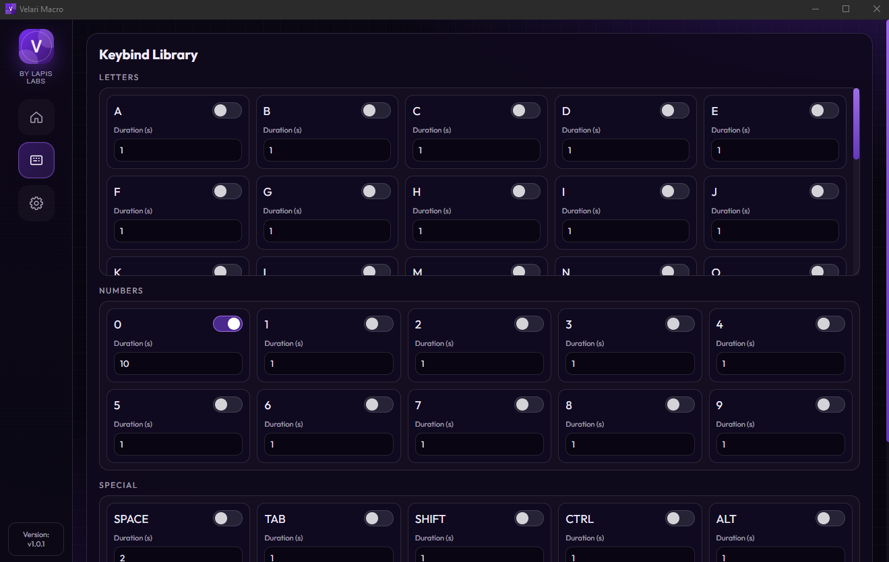
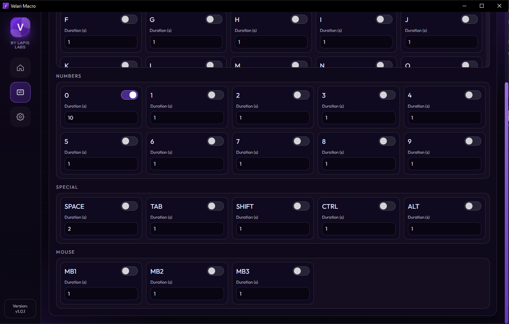
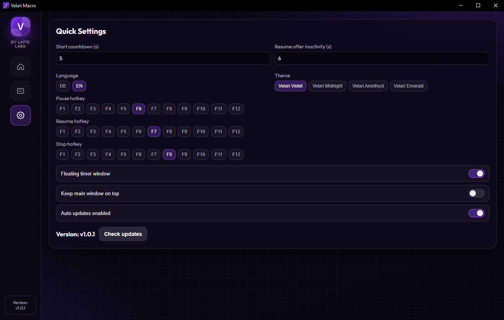

# ⚡ Velari Macro

<div align="center">

### Lightweight • Fast • Simple AFK Automation

[](#)
[](#)
[](#)

## ⬇️ Download

[](https://github.com/larpmethod/Velari-Macro/releases/latest)

</div>

---

# 📖 Overview

Velari Macro is a lightweight and user-friendly automation tool that simulates keyboard inputs at fully customizable intervals.

Built for simplicity and low resource usage, it allows users to keep applications or games active while away from the keyboard (AFK).

The application focuses on:

* ⚡ Performance
* 🧼 Clean UI design
* 🎯 Ease of use
* 🖥️ Lightweight background execution

---

# 📸 Preview

## 🏠 Home



---

## ⌨️ Keybind Configuration





---

## ⚙️ Settings



---

# ✨ Features

## 🎮 Macro Controls

* Start macro execution
* Pause active macros
* Stop macros instantly
* Real-time hotkey controls

---

## ⌨️ Custom Keybinds

Configure:

* Keyboard keys
* Key durations
* Key intervals
* Multi-key loops

---

## 🔥 Hotkeys

| Key  | Action |
| ---- | ------ |
| `F6` | Pause  |
| `F7` | Resume |
| `F8` | Stop   |

---

## ⚡ Lightweight Performance

* Minimal CPU usage
* Low memory consumption
* Fast startup times
* Smooth background execution

---

# 🛠️ How It Works

## Setup Process

1. Select the keys you want to simulate
2. Set the duration for every key
3. Start the macro
4. Velari Macro will automatically repeat the configured inputs in a loop

---

# 🎯 Use Cases

Velari Macro can be useful for:

* Preventing AFK / idle detection
* Repeating keyboard actions
* Keeping sessions active
* Testing repetitive workflows
* Automating simple keyboard tasks

---

# ⚠️ Disclaimer

This software is intended for:

* Personal use
* Educational use
* Testing purposes

Please make sure you comply with the Terms of Service of any:

* Game
* Application
* Platform
* Service

> Hobby project — future updates are not guaranteed.

---

# 🧱 System Requirements

| Requirement | Status          |
| ----------- | --------------- |
| Windows     | ✅ Supported     |
| Linux       | ❌ Not Supported |
| macOS       | ❌ Not Supported |

---

# 📄 License

This project is licensed under the MIT License.

```text
MIT License
```

---

<div align="center">

## ✨ Lightweight • Reliable • Clean

Made for simple and efficient automation.

</div>
